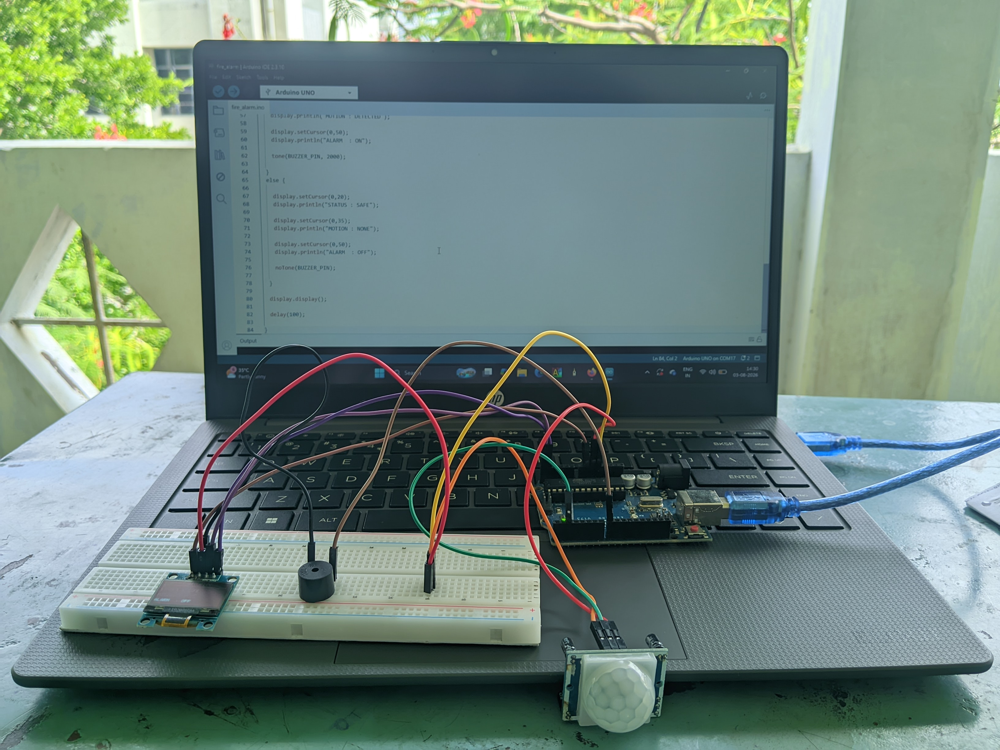
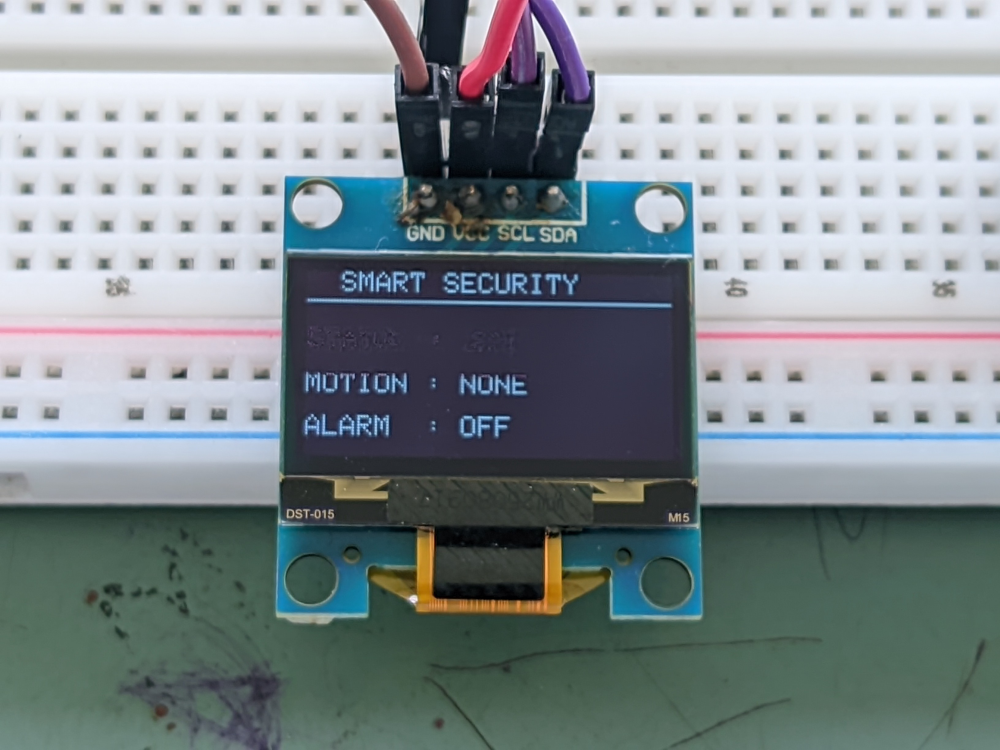
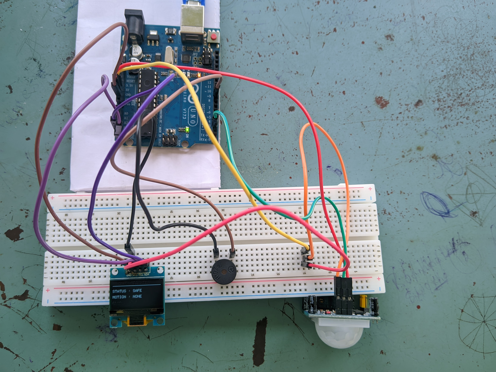

# 🚨 Arduino Smart Motion Detection Alarm

An Arduino-based motion detection alarm system that detects human movement using a PIR Motion Sensor. The system displays the current security status on a 0.96-inch SSD1306 OLED display and activates a buzzer whenever motion is detected.

---

## 📌 Features

- Motion Detection using PIR Sensor
- Real-time OLED Status Display
- Audible Alarm using Active Buzzer
- Simple and Reliable Security System
- Beginner-Friendly Embedded Project

---

## 🛠️ Components Used

- Arduino UNO
- PIR Motion Sensor
- SSD1306 OLED Display (I2C)
- Active Buzzer
- Breadboard
- Jumper Wires

---

## 🔌 Connections

### PIR Motion Sensor

| PIR Pin | Arduino UNO |
|----------|-------------|
| VCC | 5V |
| GND | GND |
| OUT | D2 |

### OLED Display

| OLED Pin | Arduino UNO |
|-----------|-------------|
| VCC | 5V |
| GND | GND |
| SDA | A4 |
| SCL | A5 |

### Buzzer

| Buzzer | Arduino UNO |
|---------|-------------|
| + | D8 |
| - | GND |

---

## 📚 Required Libraries

- Adafruit GFX
- Adafruit SSD1306

---

## 📸 Project Images

### Hardware Setup

### OLED Output

### Working Demo

---

## 🚀 Future Improvements

- ESP32 Wi-Fi Notifications
- Mobile App Alerts
- Motion Event Counter
- Cloud Logging
- Battery Backup

---

## 📄 License

MIT License
